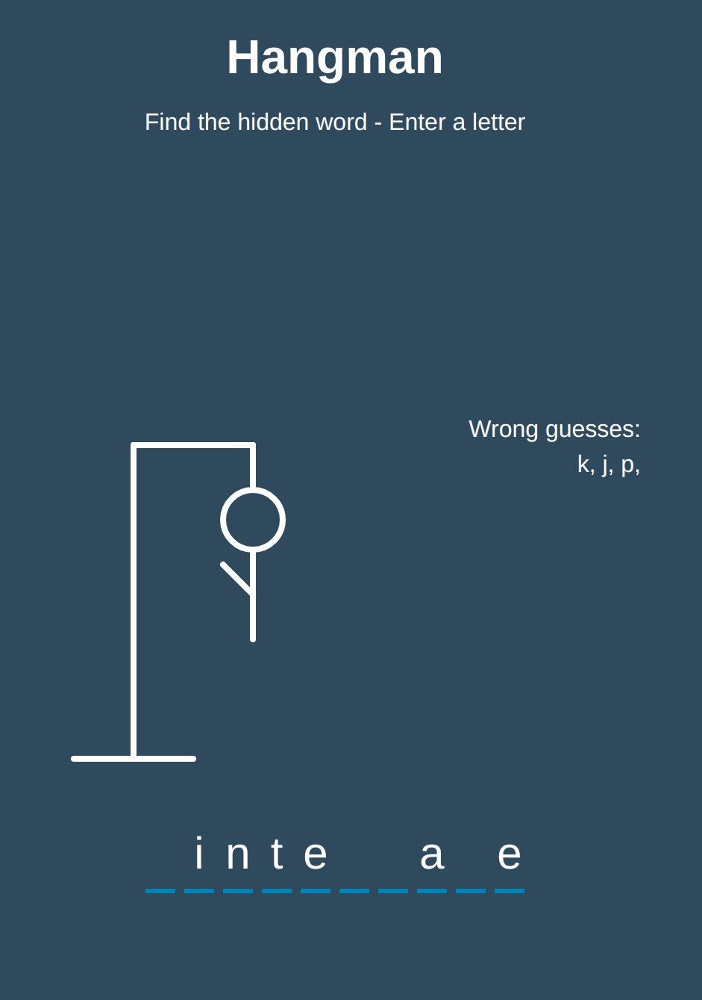

# hangman

A simple word-guessing game, using vanilla JavaScript

### Functions:

[The app](https://tn-space.github.io/hangman/)

Right now there are only 3 words in word bank.The app allows:

- to guess letter
- show wrong letters
- stop the game when hangman figure is fully appear (hangman figure is drawn using svg), or when user correctly guessed the word.
- user can play again

### Images:

